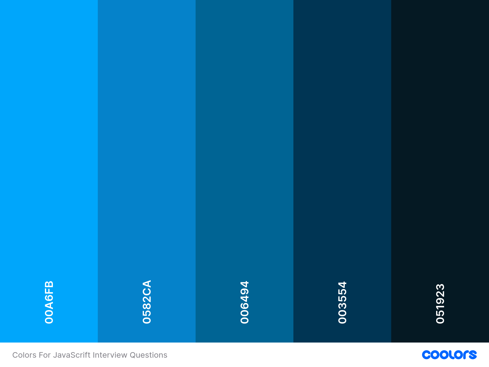

# JavaScript Interview Questions Repository

A curated collection of JavaScript interview questions and answers to help developers prepare for technical interviews. This repo covers basic to advanced topics, including ES6 features, async programming, and more. Each question includes detailed explanations. Contributions are welcome!

## Contribution Guidelines

When contributing to this repository, please adhere to the following guidelines:

- **Use only the colors provided in the above image** for any visual elements.
- Ensure your contributions are clear and concise.
- Provide detailed explanations for each question and answer.
- Format your code properly and check for errors before submitting.
- Use only font-faimly Saira-Condenesed.

Thank you for your contributions!

## Topics Covered

- Basic JavaScript Concepts
- ES6 Features
- Asynchronous Programming
- Advanced JavaScript Topics
- And more...
